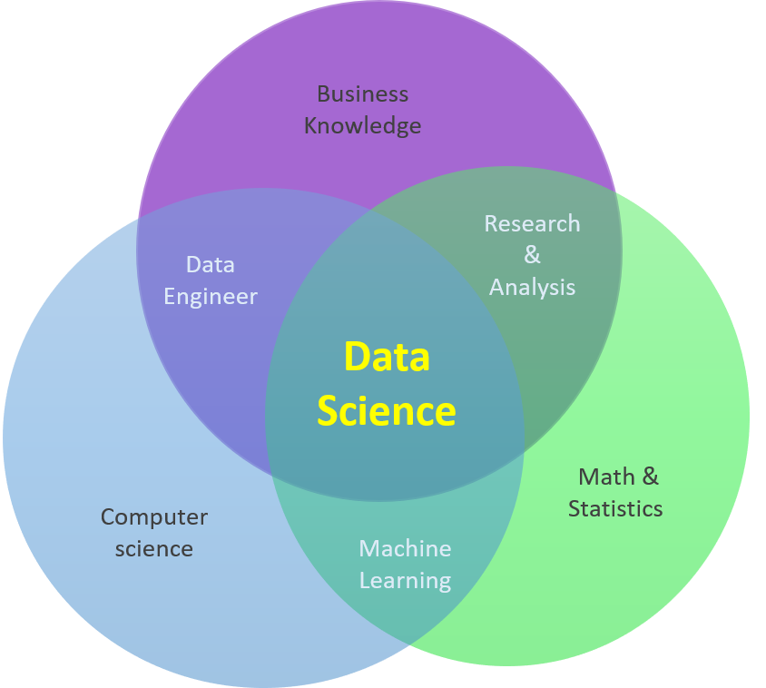

--- 
title: "Data Science Untuk Pemula"
author: "Bakti Siregar S.Si, M.Sc"
date: "`r Sys.Date()`"
site: bookdown::bookdown_site
output: 
  bookdown::gitbook:
    config:
      toc:
        collapse: subsection
        scroll_highlight: yes
      fontsettings:
        theme: white
        family: serif
        size: 2
    split_by: chapter+number
    highlight: tango
always_allow_html: yes
documentclass: book
bibliography: [book.bib, packages.bib]
biblio-style: apalike
biblatexoptions:
  - sortcites
link-citations: yes
github-repo: Bakti-Siregar/Data-Science-Untuk-Pemula
description: "Repository ini ditujukan untuk memudahkan penulisan e-book Data Science Untuk Pemula dalam bahasa Indonesia."
---

# Welcome to Data Scince{-}

```{r install-packages, include=FALSE}
# The **bookdown** package can be installed from CRAN or Github: 
# install.packages("bookdown")
# or the development version
# devtools::install_github("rstudio/bookdown")
```

```{r input-packages, include=FALSE}
# To compile this example to PDF, you need XeLaTeX. You are recommended to install TinyTeX (which includes XeLaTeX):<https://yihui.name/tinytex/>.

# automatically create a bib database for R packages
knitr::write_bib(c(.packages(),
                   'bookdown', 
                   'knitr', 
                   'rmarkdown'
), 'packages.bib')
```

<center></center>
<br> 
 
Department of Statistics
<br> 
Faculty of STEM 
<br>
Tangerang, Banten 
<br> 
<a href="https://mail.google.com/siregarbakti/">Info: siregarbakti@gmail.com</a>
<br>
<br>

## Kata Pengantar {-}

Buku ini dimulai dari tingkat pengantar, kursus praktik langsung, dirancang untuk `orang-orang pintar` dengan latar belakang dasar matematika atau statistik, ekonometrik, dan ilmu komputer, bahkan tanpa pengalaman pemrograman. Ini akan memperkenalkan Anda pada berbagai perspektif ilmu data, termasuk pemrosesan data, analisis, visualisasi, dan pemodelan. Setiap bab secara praktis akan dibahas dalam [RStudio](https://rstudio.com/products/rstudio/) Integrated Development Environment (IDE).

Seperti yang mungkin sudah Anda ketahui, sains data telah menggemparkan dunia. Setiap bidang studi dan bidang bisnis telah terpengaruh, karena orang semakin menyadari nilai dari kuantitas data yang begitu besar telah dihasilkan. Tetapi untuk mengubah nilai dari data tersebut, seseorang perlu dilatih dalam keterampilan sains data yang tepat. Bahasa pemrograman R telah menjadi salah satu yang paling terkenal untuk sains data. Bahasa pemrograman R memiliki fleksibilitas, kekuatan, kecanggihan, dan ekspresifnya telah menjadikannya alat yang tak ternilai bagi ilmuwan data di seluruh dunia.

Sebagian besar materi dalam buku ini diambil dari pengalaman mengajar saya di R dalam struktur data dan algoritme, statistik komputasi, dan sistem basis data dan tentu saja diadopsi secara menyeluruh dari berbagai tahap pengembangan. Beberapa diantaranya di dapatkan dari Coursera, Data Camp, Data Flair, R-tutorial, dll. Di sini, Anda akan belajar dari dasar-dasar pemrograman R, fungsi menulis, manipulasi data, teknik visualisasi, menangani debug, dan mengoptimalkan kode. Dengan pengalaman fundamental, Anda akan memiliki dasar yang kuat untuk membangun perjalanan sains data Anda. Jadi, nikmatilah buku ini, teruslah belajar, dan berlatihlah sebanyak yang Anda inginkan.

## Penulis {-}

Saya mulai menggunakan R pada tahun 2012 ketika saya masih menjadi mahasiswa sarjana perguruan tinggi yang saat itu sedang mengerjakan pekerjaan rumah mata kuliah Statistik Komputasi. Versi R yang saya gunakan waktu itu adalah 2.15.1. Saya adalah seorang mahasiswa jurusan matematika terapan dengan konsentrasi statistik. Setelah kuliah di bulan Oktober 2013, saya mendaftar di Management Trainee (MT) di [Asuransi Sinar Mas](https://www.sinarmas.co.id/home) sebagai Underwriter selama kurang lebih tiga bulan. Kemudian pindah ke proses pelatihan karyawan serupa yang disebut Office Deployment Program (ODP) di [MPM Finance](https://www.mpm-finance.com/) sebagai Credit Analyst (sekitar enam bulan). Setelah semua pengalaman ini, saya ingin meningkatkan studi saya ke jenjang berikutnya karena saya menganggap diri saya belum cukup baik untuk sukses dalam karir saya dengan pengetahuan yang terbatas ini. Oleh karena itu, selama mengikuti proses pelatihan, saya selalu berusaha mendaftar ke beberapa universitas luar negeri.

Pada bulan September 2014, saya beruntung karena saya mendapat kesempatan untuk melanjutkan gelar master saya di [National Sun Yat-Sen University](https://www.nsysu.edu.tw/) (Taiwan) dengan program beasiswa. Di Universitas ini, saya mendaftar di jurusan matematika terapan dengan konsentrasi statistik. Saya belajar banyak di kampus ini, mulai dari perspektif kehidupan, budaya, menghargai sesama, selalu tepat waktu, menambah ilmu statistika saya, dan sebagainya. Selama studi saya, saya bekerja dengan profesor saya sebagai asisten pengajar dan saya beruntung mendapatkan tunjangan tambahan. Untuk itu saya fokus mengajar, saya harus menghadiri Lab meeting kami satu atau dua kali seminggu, membantu acara-acara universitas, mengatur beberapa kegiatan trip, dan melakukan penelitian bersama ([Prof. Mei-Hui Guo](https://math.nsysu.edu.tw/p/406-1183-10900,r2843.php?Lang=en) dan [Prof. Chung Chang](https://math.nsysu.edu.tw/p/406-1183-33870,r2843.php?Lang=en)). Mereka menyarankan saya untuk belajar setidaknya dasar-dasar bahasa Mandarin untuk bertahan hidup di Taiwan dan harus meningkatkan kemampuan pemrograman saya dengan R, Python, SAS, dan MATLAB secara konsisten untuk menangani semua pekerjaan rumah saya juga.

Langkah selanjutnya dalam karir saya, saya masuk ke departemen teknik di PT Andalan Furnindo ([Samora Group](https://www.samoragroup.co.id/about-samora/en)) sebagai seorang analis data. Ini merupakan salah satu industri gula terbaik di Indonesia, dimana saya berada di sini setidaknya selama satu tahun sejak 2017. Kemudian saya merasa bahwa tidak semua pengetahuan saya dapat berguna di perusahaan ini, bahkan tidak dapat mengembangkannya ke tingkat yang lebih baik. Maka dengan tantangan yang besar, saya memutuskan untuk pindah ke tempat baru yaitu [Matana University](https://matanauniversity.ac.id/) pada tahun 2018, di sini saya mulai mengabdikan diri dengan mengajar statistika bisnis dan terus berkembang dengan ilmu-ilmu baru. Di sini saya banyak belajar dan mengajar tentang sains data, saya fokus mengajar struktur data dan algoritma, sistem basis data, statistik komputasi, ekonometrika, deret waktu, kalkulus, optimasi, metode penelitian, dll. Yang terpenting, saya percaya diri untuk mengatakan bahwa saya memiliki kemampuan expert dengan beberapa bahasa pemrograman seperti R, Python, SQL, dll, dan saya juga memiliki kemampuan yang cukup baik untuk menggunakan Business Intelligence Tools, seperti Tableau dan SAS.

Bakti Siregar, M.Sc
<br>
Email: siregarbakti@gmail.com atau siregar.bakti@matanauniversity.ac.id
<br>
Github: https://github.com/Bakti-Siregar
<br>
LinkedIn: https://www.linkedin.com/in/bakti-siregar-15955480/

## Asisten {-}
Saya adalah mahasiswa Universitas Matana jurusan Statistika Bisnis angkatan 2018. Pertama kali saya belajar R adalah ketika saya memasuki perkuliahan di semester ke-3 pada mata kuliah Struktur Data dan Algoritma yang diajarkan oleh Bapak Bakti Siregar, M.Sc.

Juenzy Hodawya
<br>
Email: hodawya125@gmail.com atau juenzy.hodawya@matanauniversity.ac.id
<br>
Github: https://github.com/JuenzyHodawya
<br>
LinkedIn: https://www.linkedin.com/in/juenzy-hodawya-a310ab1a3/